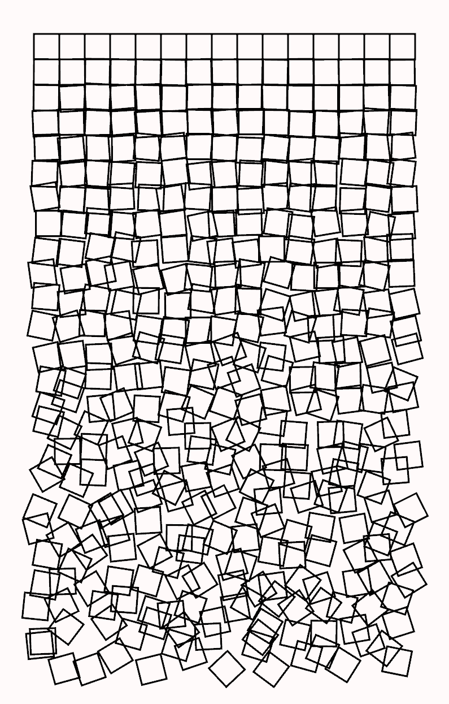

# Schotter in Rust
Generative art PoC based on Schotter by Georg Nees.

## Keymap

* `R` regenerate seed
* `S` save screenshot
* `Up` & `Down` control displacement
* `Left` & `Right` control rotation
* `Space` & `D` restore default displacement and rotation values

## License

Copyright (c) 2023 Janusz Piechówka.

This project is licensed under either of

- [Apache License, Version 2.0](https://www.apache.org/licenses/LICENSE-2.0) ([`LICENSE-APACHE`](LICENSE-APACHE))
- [MIT license](https://opensource.org/licenses/MIT) ([`LICENSE-MIT`](LICENSE-MIT))

at your option.

The [SPDX](https://spdx.dev) license identifier for this project is `MIT OR Apache-2.0`.
